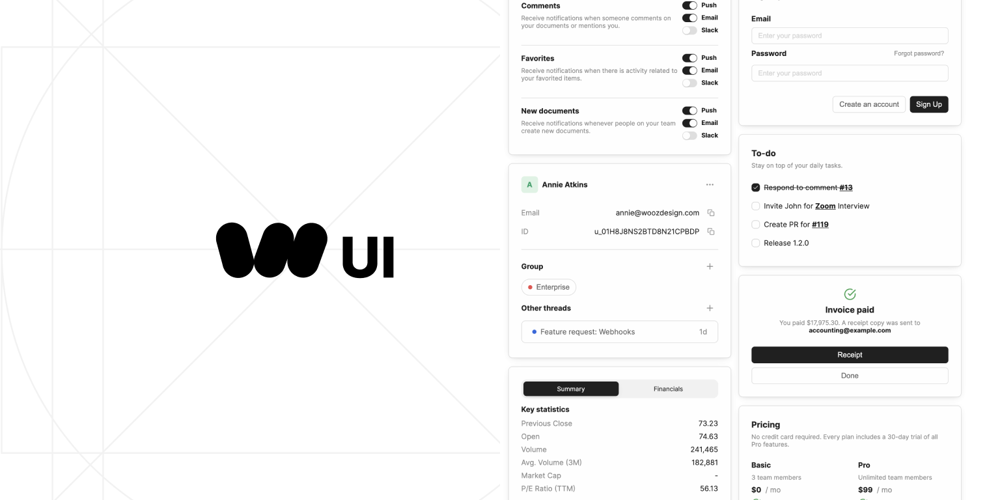

[](https://woozdesign.com)

## 🖥 Environment Support

- Modern browsers
- Server-side Rendering
- [Electron](https://www.electronjs.org/)

| [](http://godban.github.io/browsers-support-badges/)<br>Edge | [](http://godban.github.io/browsers-support-badges/)<br>Firefox | [](http://godban.github.io/browsers-support-badges/)<br>Chrome | [](http://godban.github.io/browsers-support-badges/)<br>Safari | [](http://godban.github.io/browsers-support-badges/)<br>Electron |
| ---------------------------------------------------------------------------------------------------------------------------------------------------------------------------------------------------- | ---------------------------------------------------------------------------------------------------------------------------------------------------------------------------------------------------------------- | ------------------------------------------------------------------------------------------------------------------------------------------------------------------------------------------------------------ | ------------------------------------------------------------------------------------------------------------------------------------------------------------------------------------------------------------ | -------------------------------------------------------------------------------------------------------------------------------------------------------------------------------------------------------------------- |
| Edge                                                                                                                                                                                                 | last 2 versions                                                                                                                                                                                                  | last 2 versions                                                                                                                                                                                              | last 2 versions                                                                                                                                                                                              | last 2 versions                                                                                                                                                                                                      |

## 📦 Install

> [!WARNING]  
> This project is very early-stage. Please be aware that the code structure changes frequently.

```bash
npm install @woozdesign/ui
```

```bash
yarn add @woozdesign/ui
```

```bash
pnpm add @woozdesign/ui
```

## 🔨 Usage

```jsx
import React from 'react';
import '@woozdesign/ui/styles.css';
import { Button, Layout } from '@woozdesign/ui';

const App = () => (
  <Container>
    <Row>
      <Col xs={24}>
        <Button variant="solid" color="purple">
          Button
        </Button>
      </Col>
    </Row>
  </Container>
);
```

## 💻 SSR

```jsx
'use client';

import React from 'react';
import { ThemeProvider } from '@woozdesign/ui';
import '@woozdesign/ui/styles.css';

export const RootStyleRegistry = ({ children }: React.PropsWithChildren) => {
  return <ThemeProvider appearance="light">{children}</ThemeProvider>;
};
```

## Supported Components

Wooz Design offers a robust and diverse set of components to aid in creating interactive and dynamic user interfaces. Our library is continuously evolving, and we are committed to enhancing and expanding our component offerings.
For more in-depth information on the supported components, please refer to our detailed [documentation](https://woozdesign.com).

## TypeScript

`woozdesign` is written in TypeScript with complete definitions.

## ⌨️ Development

Clone locally:

```bash
$ git clone git@github.com:woozdesign/woozdesign-ui.git
$ cd @woozdesign/ui
$ npm install
$ npm start
```

## 🤝 Contributing [](http://makeapullrequest.com)

Read our [contributing guide](./docs/git/CONTRIBUTING.md) and let's build a better woozdesign together.

We welcome all contributions. Please read our [CONTRIBUTING.md](./docs/git/CONTRIBUTING.md) first. You can submit any ideas as [pull requests](https://github.com/woozlabs/woozdesign-ui/pulls) or as [GitHub issues](https://github.com/woozlabs/woozdesign-ui/issues). If you'd like to improve code, check out the [Development Instructions]() and have a good time! :)
